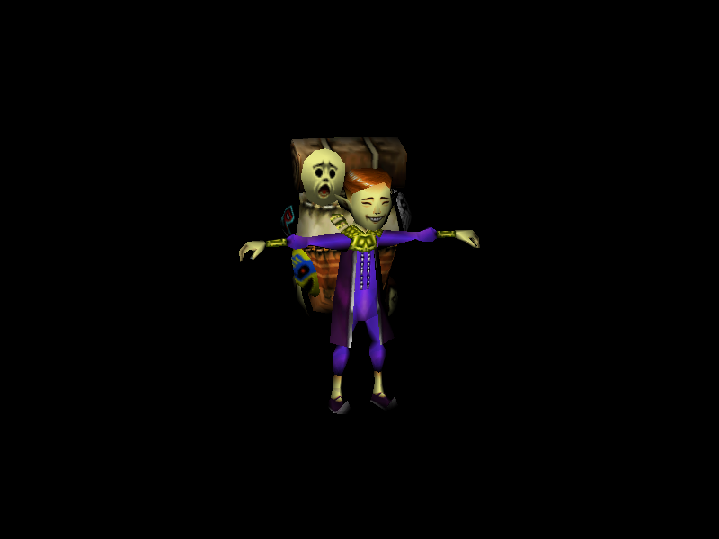

Gel (Graphical Emulation Layer) is an N64-like software renderer.

If you are on a Unix-like system, install the development package for:

    SDL2-devel

And then just do:

    make; ./gel path/to/obj path/to/bmp

Models, for educational purposes, can be found here:

    https://www.models-resource.com/nintendo_64/

Rotate the screen with the mouse.

